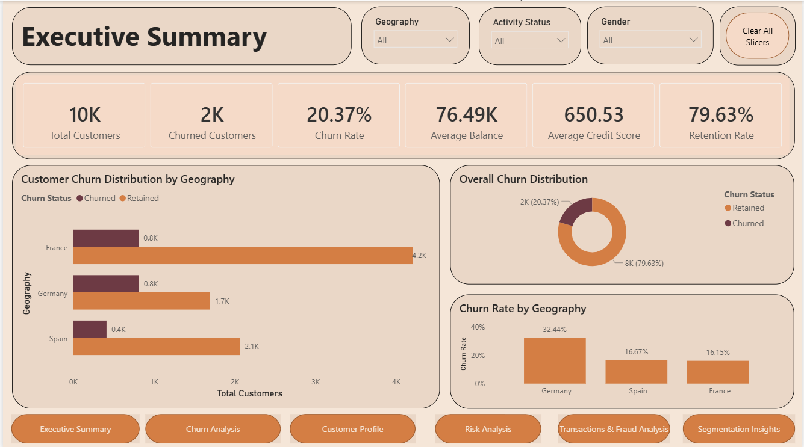
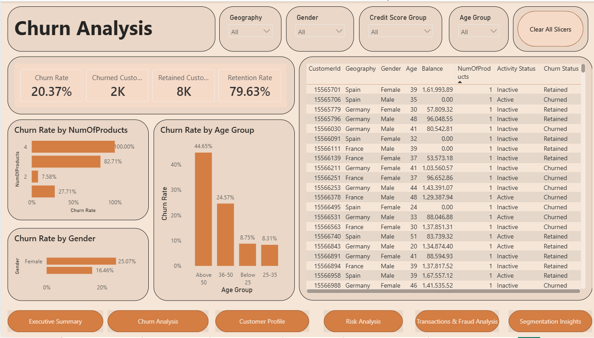
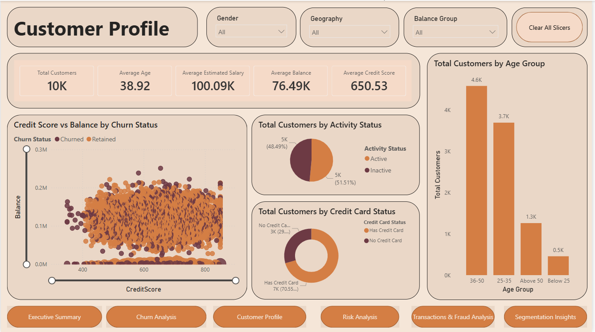
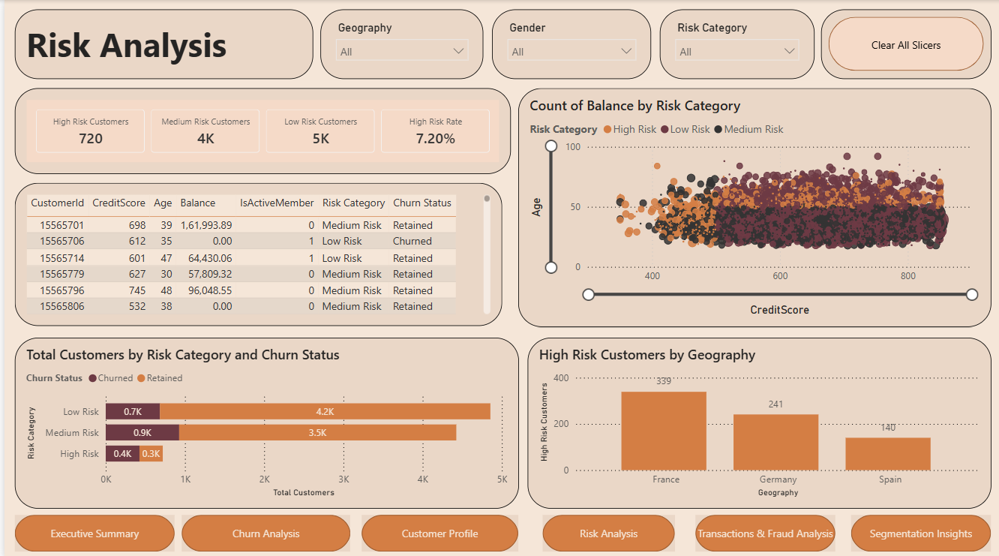
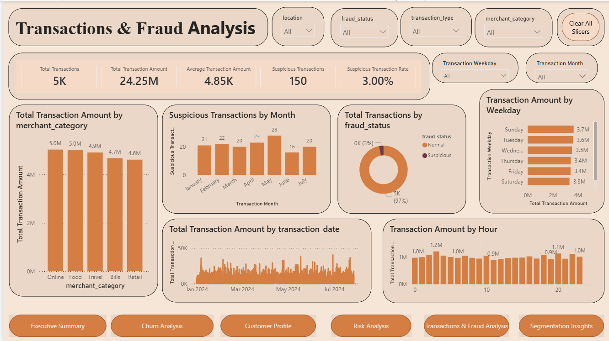
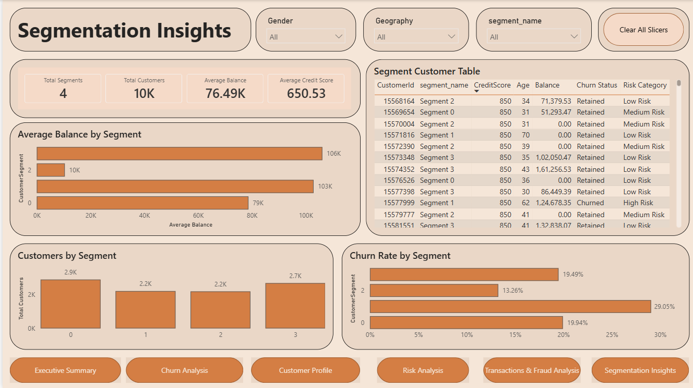

# AI-Powered Banking Customer Analytics System
 
An end-to-end banking analytics project that uses Python, SQL Server, Machine Learning, Deep Learning, Streamlit, and Power BI to analyze customer behavior, predict churn risk, detect suspicious transactions, segment customers, and generate business insights.

## Project Overview

Banks handle large volumes of customer and transaction data. This project helps analyze that data using AI and business intelligence techniques.

The system supports:

- Customer churn prediction
- Customer segmentation
- Fraud/anomaly detection
- Product recommendation
- SQL Server-based customer analytics
- Interactive Streamlit app
- Power BI dashboards for business insights

## Tech Stack

- Python
- Pandas
- NumPy
- Scikit-learn
- TensorFlow
- SQL Server
- SQL Server Management Studio
- Power BI
- DAX
- Streamlit
- Joblib
- Matplotlib
- Seaborn

## Project Files

```text
AI-Powered-Banking-Customer-Analytics-System/
|
├── README.md
├── requirements.txt
├── .gitignore
├── banking_analytics_system.ipynb
├── banking_customer_analytics_sql_server.sql
├── app.py
├── AI_Powered_Banking_Customer_Analytics_Dashboard.pbix
|
├── data/
|   └── Churn_Modelling.csv
|
├── models/
|   ├── churn_model.pkl
|   ├── segmentation_model.pkl
|   └── fraud_model.pkl
|
├── powerbi_exports/
|   ├── customers.csv
|   ├── transactions.csv
|   ├── customer_segments.csv
|   ├── churn_predictions.csv
|   └── product_recommendations.csv
|
└── screenshots/
    ├── executive_summary.png
    ├── churn_analysis.png
    ├── customer_profile.png
    ├── risk_analysis.png
    ├── transactions_fraud.png
    └── segmentation_insights.png
```

## Dataset

Dataset used:

```text
Churn_Modelling.csv
```

The dataset contains customer banking information such as:

- Customer ID
- Credit score
- Geography
- Gender
- Age
- Tenure
- Balance
- Number of products
- Credit card status
- Active member status
- Estimated salary
- Churn status

Target column:

```text
Exited
```

Meaning:

```text
0 = Retained customer
1 = Churned customer
```

## AI And Machine Learning Models

| Module | Model Used | Purpose |
|---|---|---|
| Churn Prediction | Random Forest Classifier | Predict whether a customer may leave the bank |
| Customer Segmentation | K-Means Clustering | Group customers based on behavior |
| Fraud Detection | Isolation Forest | Identify suspicious transactions |
| Deep Learning Anomaly Detection | Autoencoder | Detect unusual transaction patterns |
| Product Recommendation | Rule-based logic | Recommend suitable banking products |

## Power BI Dashboards

The Power BI report contains the following dashboard pages:

1. Executive Summary
2. Churn Analysis
3. Customer Profile
4. Risk Analysis
5. Transactions & Fraud Analysis
6. Segmentation Insights

## Dashboard Insights

The dashboards help analyze:

- Total customers
- Churned customers
- Churn rate
- Retention rate
- Average balance
- Average credit score
- High-risk customers
- Customer segments
- Transaction amount trends
- Suspicious transactions
- Fraud status distribution
- Churn by geography, gender, age group, and product count

## SQL Server Setup

This project uses SQL Server and SQL Server Management Studio for database analysis.

### Step 1: Create Database

Open SSMS and run:

```sql
CREATE DATABASE BankingAnalyticsDB;
GO
```

Then select the database:

```sql
USE BankingAnalyticsDB;
GO
```

### Step 2: Import Dataset Into SQL Server

Import `Churn_Modelling.csv` using SSMS:

1. Open SQL Server Management Studio.
2. Connect to your SQL Server instance.
3. In Object Explorer, right-click:

```text
BankingAnalyticsDB
```

4. Select:

```text
Tasks > Import Flat File
```

5. Browse and select:

```text
Churn_Modelling.csv
```

6. Set table name as:

```text
customers
```

7. Preview the data.
8. Make sure the first row is used as column names.
9. Verify data types.
10. Click `Finish`.

Recommended data types:

```text
RowNumber             int
CustomerId            int
Surname               nvarchar(100)
CreditScore           int
Geography             nvarchar(100)
Gender                nvarchar(20)
Age                   int
Tenure                int
Balance               float
NumOfProducts         int
HasCrCard             int
IsActiveMember        int
EstimatedSalary       float
Exited                int
```

### Step 3: Verify Imported Data

Run:

```sql
SELECT TOP 10 *
FROM dbo.customers;
```

Check total customers:

```sql
SELECT COUNT(*) AS total_customers
FROM dbo.customers;
```

### Step 4: Run SQL Script

After importing the dataset, run:

```text
banking_customer_analytics_sql_server.sql
```

The SQL script includes:

- Table creation
- Churn analysis queries
- Risk analysis queries
- High-value customer queries
- Customer segmentation support query
- SQL Server views

## Python Notebook

Notebook file:

```text
banking_analytics_system.ipynb
```

The notebook performs:

- Data loading
- Data cleaning
- Exploratory data analysis
- Churn prediction model training
- Customer segmentation
- Fraud detection
- Deep learning autoencoder training
- Product recommendation generation
- Model saving
- Power BI CSV export

Run the notebook first to generate:

```text
models/
powerbi_exports/
```

## Streamlit App

Streamlit app file:

```text
app.py
```

The app allows users to enter customer details and get:

- Churn risk prediction
- Churn probability
- Product recommendations

### Run Streamlit App

Install dependencies:

```bash
pip install -r requirements.txt
```

Run:

```bash
streamlit run app.py
```

The app will open at:

```text
http://localhost:8501
```

## Power BI Setup

Power BI file:

```text
AI_Powered_Banking_Customer_Analytics_Dashboard.pbix
```

Power BI uses exported CSV files from:

```text
powerbi_exports/
```

Files used:

```text
customers.csv
transactions.csv
customer_segments.csv
churn_predictions.csv
product_recommendations.csv
```

### Power BI Relationships

Create or verify these relationships:

```text
customers[CustomerId] -> transactions[customer_id]
customers[CustomerId] -> customer_segments[customer_id]
customers[CustomerId] -> churn_predictions[customer_id]
customers[CustomerId] -> product_recommendations[customer_id]
```

Main relationship:

```text
customers[CustomerId] 1 -> * transactions[customer_id]
```

## Important DAX Measures

```DAX
Total Customers =
COUNT(customers[CustomerId])
```

```DAX
Churned Customers =
CALCULATE(
    COUNT(customers[CustomerId]),
    customers[Exited] = 1
)
```

```DAX
Retained Customers =
CALCULATE(
    COUNT(customers[CustomerId]),
    customers[Exited] = 0
)
```

```DAX
Churn Rate =
DIVIDE(
    [Churned Customers],
    [Total Customers],
    0
)
```

```DAX
Retention Rate =
DIVIDE(
    [Retained Customers],
    [Total Customers],
    0
)
```

```DAX
Total Transactions =
COUNT(transactions[transaction_id])
```

```DAX
Suspicious Transactions =
CALCULATE(
    COUNT(transactions[transaction_id]),
    transactions[fraud_status] = "Suspicious"
)
```

```DAX
Suspicious Transaction Rate =
DIVIDE(
    [Suspicious Transactions],
    [Total Transactions],
    0
)
```

## How To Run The Complete Project

1. Clone the repository.
2. Install required libraries:

```bash
pip install -r requirements.txt
```

3. Open and run:

```text
banking_analytics_system.ipynb
```

4. Import `Churn_Modelling.csv` into SQL Server as the `customers` table.
5. Run:

```text
banking_customer_analytics_sql_server.sql
```

6. Run Streamlit app:

```bash
streamlit run app.py
```

7. Open Power BI file:

```text
AI_Powered_Banking_Customer_Analytics_Dashboard.pbix
```

8. Refresh Power BI data if needed.

## Results

The project successfully demonstrates:

- AI-based churn prediction
- Customer segmentation
- Fraud/anomaly detection
- Product recommendation
- SQL Server analytics
- Power BI dashboarding
- Interactive Streamlit deployment

## Screenshots

Add dashboard screenshots here:














## Future Enhancements

- Deploy the Streamlit app online
- Add FastAPI backend
- Connect Power BI directly to SQL Server
- Add real transaction dataset
- Improve recommendations using collaborative filtering
- Add model explainability using SHAP
- Add authentication for admin dashboard

## Resume Summary

Built an AI-powered banking customer analytics system using Python, SQL Server, Machine Learning, Deep Learning, Streamlit, and Power BI to predict customer churn, segment customers, detect suspicious transactions, recommend products, and generate business insights through interactive dashboards.
